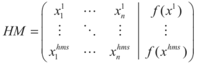
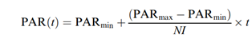
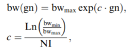

# Название метода: Гармонический поиск (Harmony Search)

## Историческая справка

В 2001 году Geem разработал и предложил алгоритм гармонического поиска (Harmony Search, или HS). Некоторые авторы утверждают, что алгоритм был вдохновлен игрой джаз-музыкантов, другие полагают, что в основе лежит процесс создания приятной мелодии. Это и легло в основу алгоритма.

## Возможности метода

Находит как глобальный, так и локальный минимум в зависимости от начальных данных:
- **Локальный:** Если начальная точка или гармония находится близко к локальному минимуму, алгоритм может застрять в нем, особенно если параметры (например, коэффициент гармонического поиска или HMCR) настроены так, что процесс склоняется к более детализированным локальным решениям.
- **Глобальный:** Метод способен избежать застревания в локальных минимумах, особенно если используются случайные элементы в процессе поиска (параметр PAR), которые настроены должным образом.

## Типы функций

Подходит для работы с:
- Многомерными функциями.
- Негладкими функциями.
- Функциями непрерывной и дискретной оптимизации.

## Плюсы метода

- Простота реализации и понимания.
- Малое количество настраиваемых параметров и рекомендации по их выбору.
- Метод нулевого порядка (нет необходимости в численном дифференцировании).
- Удобство встраивания в другие методы (например, меметические алгоритмы или генетические алгоритмы).

## Минусы метода

- Низкая скорость сходимости.
- Плохо применим для задач больших размерностей из-за простоты составляющих.

## Алгоритм метода

### Шаг 1. Инициализация алгоритма
Задать параметры метода:
- `hms` — размер памяти гармонии;
- `hmcr` — частота выбора значений из памяти гармонии;
- `par` — частота выбора соседнего значения;
- `fw` — вектор максимального изменения приращения;
- `K` — максимальное число итераций.

Установить начальное число итераций `k = 0`.

### Шаг 2. Формирование начального множества решений
На множестве допустимых решений сгенерировать `hms` решений `x1, x2, ..., xhms`. 
Вычислить соответствующие значения целевой функции `f(x1), f(x2), ..., f(xhms)` и сохранить их в памяти гармонии (НМ).

### Шаг 3. Генерация нового решения
Сгенерировать новый вектор `xnew`. Для всех `i = 1, ..., n` выполнить следующие действия:
1. Получить значение `xi'` следующим образом:
   - с вероятностью `hmcr` выбрать элемент из памяти НМ с номером `int[u(0,1) * hms] + 1`, где `u(0,1)` — равномерно распределенное число от 0 до 1, а `int[*]` — операция нахождения целой части числа:
     - `xi' = xi[int[u(0,1) * hms] + 1]`
   - с вероятностью `1 - hmcr` выбрать значение внутри промежутка `[ai, bi]`, где `xi' ∈ [ai, bi]`.
2. Если значение `xi'` выбрано из памяти:
   - с вероятностью `par` найти:
     - `xinew = xi' + fwi * u(-1,1)`, где `u(-1,1)` — равномерно распределенное число на отрезке `[-1,1]`.
   - с вероятностью `1 - par` оставить:
     - `xinew = xi'`.

### Шаг 4. Обновление памяти гармонии
Если новое решение `xnew` лучше наихудшего решения `xworst` в памяти, то заменить `xworst` на `xnew`. Если иначе — не заменять.

### Шаг 5. Проверка условий окончания процесса поиска
- Если `k < K - 1`, то установить `k = k + 1` и перейти к шагу 3.
- Если `k = K - 1`, процесс завершается.

### Шаг 6. Найти наилучшее решение
Найти наилучшее решение `xbest` в памяти и установить `x* = xbest`.

## Модификации метода

Чтобы устранить недостатки HS, Махдави предложил новый вариант HS, названный **Improved Harmony Search (IHS)**. IHS динамически обновляет параметр `PAR` в соответствии со следующим уравнением:

- **PAR(t)** — частота выбора соседнего значения для поколения `t`.
- **PARmin** — минимальная частота выбора соседнего значения.
- **PARmax** — максимальная частота выбора соседнего значения.
- **t** — номер поколения.

### Обновление параметра `fw`
Кроме того, параметр `fw` также обновляется динамически в процессе работы алгоритма:

- **bw(t)** — вектор максимального изменения приращения для поколения `t`.
- **bwmin** — минимальный вектор максимального изменения приращения.
- **bwmax** — максимальный вектор максимального изменения приращения.
- **t** — номер поколения.
